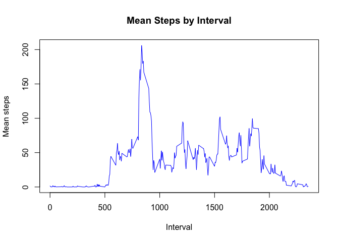

## Loading and preprocessing the data
Load activity csv file to a data table

```r
library("data.table")
actData <- data.table::fread("data/activity.csv")
```

## What is mean total number of steps taken per day?
#### 1. Calculate the total number of steps taken per day

```r
dailySteps <- actData[!is.na(steps),sum(steps), by=date]
setnames(dailySteps, "V1", "daily_steps")
head(dailySteps, 10)
```

```
##           date daily_steps
##  1: 2012-10-02         126
##  2: 2012-10-03       11352
##  3: 2012-10-04       12116
##  4: 2012-10-05       13294
##  5: 2012-10-06       15420
##  6: 2012-10-07       11015
##  7: 2012-10-09       12811
##  8: 2012-10-10        9900
##  9: 2012-10-11       10304
## 10: 2012-10-12       17382
```

#### 2. Make a histogram of the total number of steps taken each day


```r
hist(dailySteps$daily_steps, breaks = 8, col ="lightgray", main = "Histogram of Steps each Day", xlab = "Steps", ylab = "Days" )
```

<!-- -->
    
#### 3. Mean and median of the total number of steps taken per day

```r
meanSteps <- mean(dailySteps$daily_steps)
meanSteps
```

```
## [1] 10766.19
```

```r
medianSteps <- median(dailySteps$daily_steps)
medianSteps
```

```
## [1] 10765
```

## What is the average daily activity pattern?

Create a data table with the mean of steps for each interval, excluding any observations missing step data.

```r
intervalSteps <- actData[!is.na(steps), mean(steps), by=interval]
setnames(intervalSteps, "V1","mean_steps")
```

#### 1. Time series plot of 5 minutes of interval (x-axis) and the average number of steps taken, averaged across all days (y-axis)


```r
plot(x = intervalSteps$interval, y = intervalSteps$mean_steps, col="blue", type = "l", main="Mean Steps by Interval", xlab = "Interval", ylab = "Mean steps")
```

<!-- -->

#### 2. Which 5-minute interval, on average across all the days in the dataset, contains the maximum number of steps?


```r
maxInterval <- intervalSteps[mean_steps == max(intervalSteps$mean_steps), interval]
maxInterval
```

```
## [1] 835
```

## Imputing missing values
#### Total of missing values in dataset

```r
countMissingVal <- sum(is.na(actData$steps))
countMissingVal
```

```
## [1] 2304
```
#### Filling in all of the missing values in the dataset with median

```r
actData[is.na(steps), "steps"] <- actData[, c(lapply(.SD, median, na.rm = TRUE)), .SDcols = c("steps")]
```

#### Create a new dataset that is equal to the original dataset but with the missing data filled in

```r
data.table::fwrite(x = actData, file ="data/tidyData.csv", quote =FALSE)
```

#### Make a histogram of the total number of steps taken each day and Calculate and report the mean and median total number of steps taken per day.

Get number steps taken per day from tidy data

```r
newActData <- data.table::fread("data/tidyData.csv")
newDailySteps <- newActData[,sum(steps), by = date]
setnames(newDailySteps,"V1", "daily_steps")
head(newDailySteps, 10)
```

```
##           date daily_steps
##  1: 2012-10-01           0
##  2: 2012-10-02         126
##  3: 2012-10-03       11352
##  4: 2012-10-04       12116
##  5: 2012-10-05       13294
##  6: 2012-10-06       15420
##  7: 2012-10-07       11015
##  8: 2012-10-08           0
##  9: 2012-10-09       12811
## 10: 2012-10-10        9900
```
Histogram from Tidy data


```r
hist(newDailySteps$daily_steps, breaks=8, col = "lightgray",main= "Histogram of Steps each Day", xlab = "Steps", ylab = "Days")
```

<!-- -->
#### Mean and median total number of steps taken per day fron tidy Data

```r
newMeanSteps <- mean(newDailySteps$daily_steps)
newMeanSteps
```

```
## [1] 9354.23
```

```r
newMedianSteps <- median(newDailySteps$daily_steps)
newMedianSteps
```

```
## [1] 10395
```

#### What is the impact of imputing missing data on the estimates of the total daily number of steps?

Type of Estimate | Mean | Median
--- | --- | ---
With na | 1.0766189\times 10^{4} | 10765
Filling na with median | 9354.2295082 | 10395


## Are there differences in activity patterns between weekdays and weekends?
#### 1. Create a new factor variable in the dataset with two levels – “weekday” and “weekend”

```r
newActData[, day_type := as.factor(
                        ifelse( (tolower(weekdays(date)) == "saturday") | 
                                (tolower(weekdays(date)) == "sunday"),
                              "weekend", 
                              "weekday"))]
levels(newActData$day_type)
```

```
## [1] "weekday" "weekend"
```

```r
head(newActData)
```

```
##    steps       date interval day_type
## 1:     0 2012-10-01        0  weekday
## 2:     0 2012-10-01        5  weekday
## 3:     0 2012-10-01       10  weekday
## 4:     0 2012-10-01       15  weekday
## 5:     0 2012-10-01       20  weekday
## 6:     0 2012-10-01       25  weekday
```
#### 2. Make a plot containing time series of the 5-minute interval (x-axis) and the average number of steps taken, averaged across all weekday days or weekend days (y-axis)

Get Mean steps for each interval and day type

```r
stepsByType <- newActData[, mean(steps), by=c("interval","day_type")] 
setnames(stepsByType, "V1", "mean_steps")
head(stepsByType)
```

```
##    interval day_type mean_steps
## 1:        0  weekday 2.02222222
## 2:        5  weekday 0.40000000
## 3:       10  weekday 0.15555556
## 4:       15  weekday 0.17777778
## 5:       20  weekday 0.08888889
## 6:       25  weekday 1.31111111
```
Plot

```r
par(mfrow = c(2,1))
plot(x = stepsByType[day_type == "weekend",interval],
      y = stepsByType[day_type == "weekend",mean_steps],
      type = "l",
      col = "blue",
      main = "Mean Steps By Interval - Weekend",
      xlab = "Interval",
      ylab = "Number of Steps")
plot(x = stepsByType[day_type == "weekday",interval],
      y = stepsByType[day_type == "weekday",mean_steps],
      type = "l",
      col = "blue",
      main = "Mean Steps By Interval - Weekday",
      xlab = "Interval",
      ylab = "Number of Steps")
```

<!-- -->

